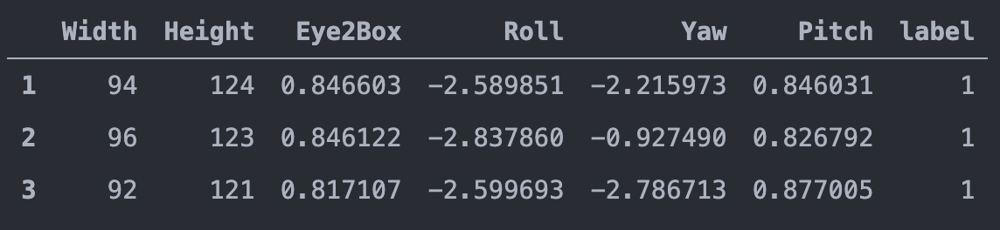

# 노트북 자세 판별기

2020-2 YBIGTA 컨퍼런스

### References

- [Facial landmarks with dlib, OpenCV, and Python](https://www.pyimagesearch.com/2017/04/03/facial-landmarks-dlib-opencv-python/)
- [Detect eyes, nose, lips, and jaw with dlib, OpenCV, and Python](https://www.pyimagesearch.com/2017/04/10/detect-eyes-nose-lips-jaw-dlib-opencv-python/)
- [Yaw Pitch Roll Detection using Retina Face](https://github.com/fisakhan/Face_Pose)
- [Simple Random Forest Classification Example](https://github.com/codebasics/py/blob/master/ML/11_random_forest/11_random_forest.ipynb)
- [Random Forest Hyperparameter Tuning](https://towardsdatascience.com/hyperparameter-tuning-the-random-forest-in-python-using-scikit-learn-28d2aa77dd74)
- [Saving Models with Scikit-learn](https://scikit-learn.org/stable/modules/model_persistence.html)

### Description

Pitch, Roll, Yaw는 회전 축을 세 개로 쪼개놓은 것이다.


얼굴의 크기(Width, Height)와 Pitch가 자세와 유의미한 상관관계가 있음을 보여준다.


### CNN에서 보완할 점들

- 옷과 배경에 따라서 결과값이 변화
- 노트북 화각에 따라서 결과값이 변화
- 거리에 따라서 성능 변화

즉, 사진 안에 있는 요소들이 성능에 방해하는 경우가 있었음.

### 해결방법

얼굴 외적인 요소들을 통제하기 위해서 face coordinates을 그려넣고, 이를 이용함.

이 때 선택의 기로가 있었음. Dlib과 Retinaface 중 face coordinates를 찍는 모델을 어떤 걸 쓸지 선택해야 했음.

- Dlib: 모델 사이즈는 300Mb이며, 68개의 점을 얼굴에 찍는다.
- Retinaface(tf2): 모델 사이즈는 2Mb이며, 5개의 점을 각각 눈, 코, 입에 찍는다.

Yaw, Pitch, Roll만 알아내는데는 평면 얼굴 사진의 5개 점으로 충분했음. 용량과 속도 측면에서도 Retinaface가 유리해서, Retinaface 채택.



얼굴의 크기(Width, Height), 눈 사이의 거리(Eye2Box), 회전(Roll, Yaw, Pitch)를 갖고 자세를 판별하도록 했다.

이 때 판별(prediction) 모델은 Random Forest Model을 채택했다.

상식적으로도 생각해보자. 제일 먼저 따져야 하는 것은 얼굴의 크기 혹은 근접도이다. 그 다음에 고개가 회전한 정도를 따져야만 자세를 판별할 수 있다.

즉 가지치기 방식이 적절하므로, Random Forest를 채택했다. Train, validset을 8:2로 나눴을 때, 모델 정확도는 93%가 나왔다.

부가적으로 Random Search Cross Validation을 이용하여 Hyperparameter 튜닝을 했다.

### How to run

you have to use terminal bash shell or iTerm2 zsh shell

```bash
cd /Users/noopy/Documents/ml_classification_tutorial/turtleneck/opencv
python pose_detection.py
```
